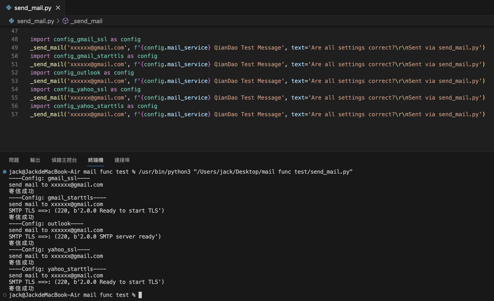

## 測試服務提供商與設定範例
|  服務提供商  |  加密協議  |  設定範例  |
|  ----  |  ----  |  ----  |
|  Gmail  |  SSL  |  [config_gmail_ssl.py](config_gmail_ssl.py)  |
|  Gmail  |  STARTTLS  |  [config_gmail_starttls.py](config_gmail_starttls.py)  |
|  ----  |  ----  |  ----  |
|  Yahoo  |  SSL  |  [config_yahoo_ssl.py](config_yahoo_ssl.py)  |
|  Yahoo  |  STARTTLS  |  [config_yahoo_starttls.py](config_yahoo_starttls.py)  |
|  ----  |  ----  |  ----  |
|  Outlook  |  STARTTLS  |  [config_yahoo_ssl.py](config_yahoo_ssl.py)  |

## 測試結果

## 參數說明

|  參數  |  說明  |  預設值  |
|  ----  |  ----  |  ----  |
|  mail_smtp  |  STMP伺服器位址  |  無  |
|  mail_port  |  STMP伺服器埠號  |  465  |
|  mail_ssl  |  使用SSL加密協議  |  True  |
|  mail_starttls  |  使用STARTTLS加密協議  |  False  |
|  mail_user  |  登入驗證帳號  |  無  |
|  mail_password  |  登入驗證密碼  |  無  |
|  mail_from  |  寄件者  |  等同mail_user  |
|  ----  |  ----  |  ----  |
|  mail_service  |  服務提供商(僅在本專案識別config用)  |  無  |

在預設情況下, 使用465埠與SSL加密協議進行連線

|  參數  |  預設值  |
|  ----  |  ----  |
|  mail_port  |  465  |
|  mail_ssl  |  False  |
|  mail_starttls  |  True  |

`mail_ssl`與`mail_starttls`僅能擇一開啟

在預設設定下, 開啟`mail_starttls`並關閉`mail_ssl`

|  參數  |  設定值  |
|  ----  |  ----  |
|  mail_ssl  |  False  |
|  mail_starttls  |  True  |

強制使用465埠連線並使用STARTTLS加密協議

或是再接續變更`mail_port`之設定值

|  參數  |  設定值  |
|  ----  |  ----  |
|  mail_ssl  |  False  |
|  mail_starttls  |  True  |
|  mail_port  |  25  |

強制使用25埠連線並使用STARTTLS加密協議

## 各家服務商設定值整理

### Google Mail, GMail - SSL

|  參數  |  設定值  |
|  ----  |  ----  |
|  mail_smtp  |  smtp.gmail.com  |
|  mail_port  |  465  |
|  mail_ssl  |  True  |
|  mail_starttls  |  False  |

### Google Mail, GMail - STARTTLS

|  參數  |  設定值  |
|  ----  |  ----  |
|  mail_smtp  |  smtp.gmail.com  |
|  mail_port  |  587 |
|  mail_ssl  |  False  |
|  mail_starttls  |  True  |

### Outlook - STARTTLS (已不再提供SSL加密協議進行連線)

|  參數  |  設定值  |
|  ----  |  ----  |
|  mail_smtp  |  smtp-mail.outlook.com  |
|  mail_port  |  587  |
|  mail_ssl  |  False  |
|  mail_starttls  |  True  |

### Yahoo Mail - SSL

|  參數  |  設定值  |
|  ----  |  ----  |
|  mail_smtp  |  smtp.mail.yahoo.com  |
|  mail_port  |  465  |
|  mail_ssl  |  True  |
|  mail_starttls  |  False  |

### Yahoo Mail - STARTTLS

|  參數  |  設定值  |
|  ----  |  ----  |
|  mail_smtp  |  smtp.mail.yahoo.com  |
|  mail_port  |  587  |
|  mail_ssl  |  False  |
|  mail_starttls  |  True  |

### Hinet nologin - STARTTLS

|  參數  |  設定值  |
|  ----  |  ----  |
|  mail_smtp  |  168.95.x.x  |
|  mail_port  |  25  |
|  mail_ssl  |  False  |
|  mail_user  |  **!不設置!**  |